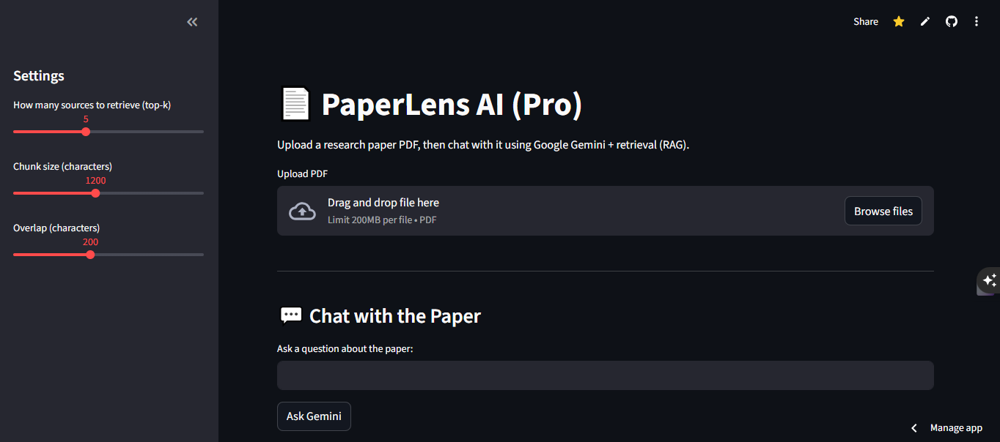

---

# 📄 PaperLens AI

### Chat With Research Papers Using Google Gemini

<p align="center">


</p>

---

# 🚀 Overview

**PaperLens AI** is an AI-powered application that allows users to **upload research papers and interact with them conversationally**.

Instead of reading long academic papers line by line, users can ask questions like:

```
What is the research gap in this paper?
What dataset was used?
What methodology does the paper propose?
What are the limitations of the study?
```

PaperLens AI retrieves the **most relevant sections of the paper** and uses **Google Gemini** to generate contextual answers.

This transforms static research documents into an **interactive knowledge system**.

---

# 🎥 Demo



Example UI:

```
Upload Research Paper
↓
Extract + Chunk Paper
↓
Create Embeddings
↓
Ask Gemini
```

Example query:

```
What is the research gap of this paper?
```

Example output:

```
The research gap addressed by this paper is the inability of
traditional forecasting models to capture both temporal
dependencies and trend smoothing simultaneously.
```

---

# 🧠 Key Features

### 📄 PDF Research Paper Upload

Upload academic papers directly into the system.

---

### ✂️ Automatic Text Chunking

The document is automatically divided into semantic sections.

---

### 🧬 Vector Embeddings

Each chunk is converted into embeddings using **Gemini embedding models**.

---

### 🔎 Semantic Retrieval

Relevant sections of the paper are retrieved using **vector similarity search**.

---

### 🤖 AI-Powered Answers

Google Gemini generates contextual responses grounded in the document.

---

# 🏗 System Architecture

PaperLens AI implements a **Retrieval-Augmented Generation (RAG)** pipeline.

```
           Research Paper PDF
                   │
                   ▼
        Text Extraction (PyPDF2)
                   │
                   ▼
            Text Chunking
                   │
                   ▼
           Gemini Embeddings
                   │
                   ▼
       Vector Similarity Search
                   │
                   ▼
         Relevant Context Retrieval
                   │
                   ▼
         Gemini Generates Answer
```

This approach ensures the AI answers questions **based on the paper itself** rather than general knowledge.

---

# 🧩 Project Structure

```
paperlens-ai
│
├── app.py
├── requirements.txt
├── README.md
├── .env
│
└── utils
    ├── pdf_reader.py
    ├── chunking.py
    ├── embeddings.py
    ├── retrieval.py
    ├── gemini_client.py
    └── prompts.py
```

---

# ⚙️ Installation

### 1️⃣ Clone the repository

```bash
git clone https://github.com/aggreypaintsil168/paperlens-ai.git
cd paperlens-ai
```

---

### 2️⃣ Install dependencies

```bash
pip install -r requirements.txt
```

---

### 3️⃣ Set up Gemini API key

Create a `.env` file:

```
GEMINI_API_KEY=your_api_key_here
```

Get your API key from:

```
https://aistudio.google.com/app/apikey
```

---

# ▶️ Running the Application

Start the Streamlit app:

```bash
python -m streamlit run app.py
```

Then open:

```
http://localhost:8501
```

---

# 📊 Example Workflow

```
1️⃣ Upload Research Paper

2️⃣ Extract + Chunk Paper

3️⃣ Create Embeddings

4️⃣ Ask Questions
```

Example:

```
User: What dataset was used in this study?

AI: The paper evaluates the proposed model using the
M4 forecasting dataset, which contains over 100,000
time series across multiple domains.
```

---

# 🛠 Tech Stack

| Technology        | Purpose           |
| ----------------- | ----------------- |
| Python            | Backend logic     |
| Streamlit         | Web interface     |
| Google Gemini API | AI model          |
| PyPDF2            | PDF parsing       |
| NumPy             | Vector operations |
| Scikit-learn      | Similarity search |

---

# ⚠️ Known Limitations

* Gemini API quotas may restrict requests on free tier
* Some research PDFs have complex formatting
* Large documents may require more advanced chunking

---

# 🔮 Future Improvements

Planned features include:

* 📚 Multi-paper comparison
* 🔬 Automatic research gap detection
* 📑 Citation extraction
* 📊 Research summarization dashboards
* 🧠 Academic knowledge graphs
* 🔎 Semantic research search

---

# 🤝 Contributing

Contributions are welcome!

Steps:

1. Fork the repository
2. Create a feature branch
3. Submit a pull request


---

# 🌍 Inspiration

Academic research is growing faster than ever.

PaperLens AI aims to make **scientific knowledge easier to explore, understand, and interact with** using AI.

---

# ⭐ Support

If you like this project:

⭐ Star the repository
🍴 Fork the project
📢 Share with researchers and students

---

# 👨‍💻 Author

Built with ❤️ using **Google Gemini AI**

---
